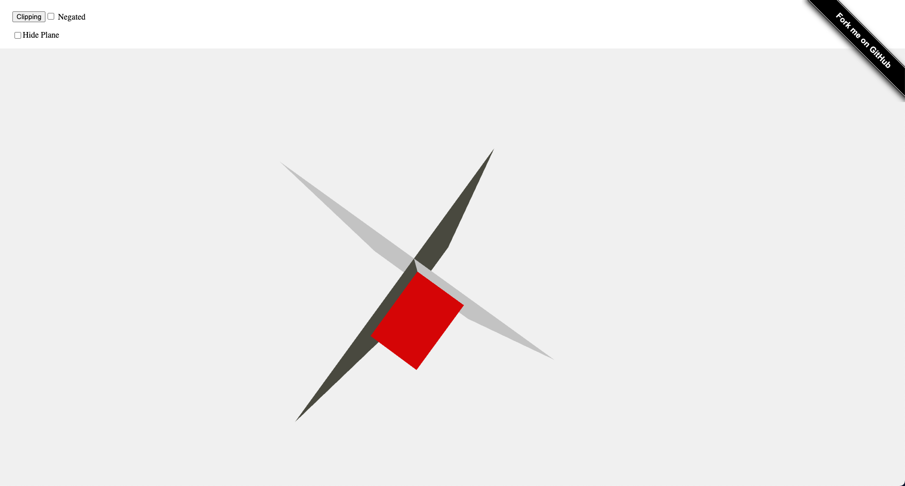

# Clipping with three.js
Clipping multiple objects and close the mesh with the original color of the object with the [three.js](https://threejs.org/) library.

I created another repo, [three-clipping-vr](https://github.com/AngyDev/three-clipping-vr) with the same clipping function but applied to the VR environment. A working progress work.

### Demo
https://threejs-clipping.netlify.app

## Table of Contents
- [Clipping with three.js](#clipping-with-threejs)
    - [Demo](#demo)
  - [Table of Contents](#table-of-contents)
  - [General info](#general-info)
  - [Setup](#setup)

## General info

The purpose of this example is to clip the objects, with multiple planes, and to close the mesh with the color of the object itself. It's also possibile to negate the clipping to have the other part of the clipping.

In this case is not possible to choose which part of the objects render with the clipping, maybe a future issue to develop.

The algorithm is composed by the following steps:

1. Gets the planes in the scene (THREE.PlaneGeometry)
2. Calculates the center of each plane
3. Creates a plane (THREE.Plane) for each plane (THREE.PlaneGeometry)
4. Calculates the barycenter of the planes
5. Gets the distance from the plane and the barycenter
6. Negates only the plane with negative distance
7. Creates the clipping object with colors

Step seven is similar to the official [three.js example](https://threejs.org/examples/?q=clipping#webgl_clipping_stencil)

The file index1plane.js is the clipping with only one plane. If you want to try this change the name from index1plane to index.

## Setup

If you want to start the application in local:

1. Clone the project `git clone git@github.com:AngyDev/threejs-clipping.git`
2. With your terminal go in the folder where you cloned the project
3. Run the command `npm init` that create the package.json file
4. Run the command `npm i live-server` that install the server on your project
5. Run the server with the command `live-server`
